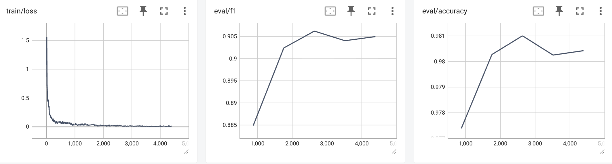
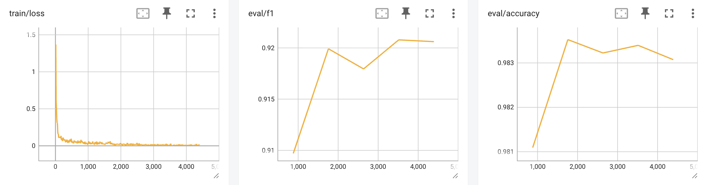
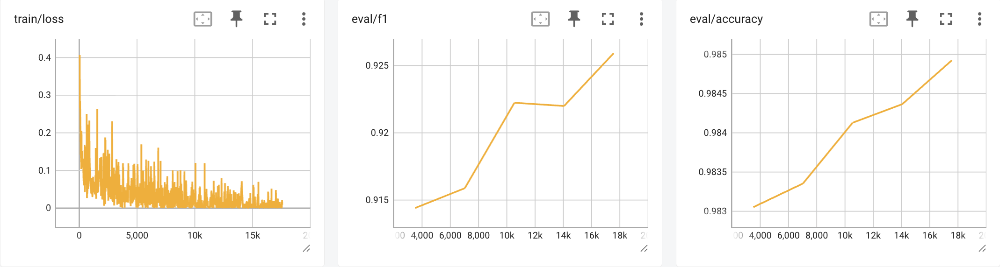

# BERT for Named Entity Recognition

cs5489 course project, BERT (and roberta) for Named Entity Recognition on CoNLL03

## How to run

```bash 

python experiment.py

```

## Dataset 
The shared task of CoNLL-2003 concerns language-independent named entity recognition. We will concentrate on four types of named entities: persons, locations, organizations and names of miscellaneous entities that do not belong to the previous three groups.

The CoNLL-2003 shared task data files contain four columns separated by a single space. Each word has been put on a separate line and there is an empty line after each sentence. The first item on each line is a word, the second a part-of-speech (POS) tag, the third a syntactic chunk tag and the fourth the named entity tag. The chunk tags and the named entity tags have the format I-TYPE which means that the word is inside a phrase of type TYPE. Only if two phrases of the same type immediately follow each other, the first word of the second phrase will have tag B-TYPE to show that it starts a new phrase. A word with tag O is not part of a phrase. Note the dataset uses IOB2 tagging scheme, whereas the original dataset uses IOB1.

For more details see [https://www.clips.uantwerpen.be/conll2003/ner/](https://www.clips.uantwerpen.be/conll2003/ner/) and [https://www.aclweb.org/anthology/W03-0419](https://www.aclweb.org/anthology/W03-0419)

### Data Fields

The data fields are the same among all splits.

#### conll2003
- `id`: a `string` feature.
- `tokens`: a `list` of `string` features.
- `pos_tags`: a `list` of classification labels (`int`). Full tagset with indices:

```python
{'"': 0, "''": 1, '#': 2, '$': 3, '(': 4, ')': 5, ',': 6, '.': 7, ':': 8, '``': 9, 'CC': 10, 'CD': 11, 'DT': 12,
 'EX': 13, 'FW': 14, 'IN': 15, 'JJ': 16, 'JJR': 17, 'JJS': 18, 'LS': 19, 'MD': 20, 'NN': 21, 'NNP': 22, 'NNPS': 23,
 'NNS': 24, 'NN|SYM': 25, 'PDT': 26, 'POS': 27, 'PRP': 28, 'PRP$': 29, 'RB': 30, 'RBR': 31, 'RBS': 32, 'RP': 33,
 'SYM': 34, 'TO': 35, 'UH': 36, 'VB': 37, 'VBD': 38, 'VBG': 39, 'VBN': 40, 'VBP': 41, 'VBZ': 42, 'WDT': 43,
 'WP': 44, 'WP$': 45, 'WRB': 46}
```

- `chunk_tags`: a `list` of classification labels (`int`). Full tagset with indices:

```python
{'O': 0, 'B-ADJP': 1, 'I-ADJP': 2, 'B-ADVP': 3, 'I-ADVP': 4, 'B-CONJP': 5, 'I-CONJP': 6, 'B-INTJ': 7, 'I-INTJ': 8,
 'B-LST': 9, 'I-LST': 10, 'B-NP': 11, 'I-NP': 12, 'B-PP': 13, 'I-PP': 14, 'B-PRT': 15, 'I-PRT': 16, 'B-SBAR': 17,
 'I-SBAR': 18, 'B-UCP': 19, 'I-UCP': 20, 'B-VP': 21, 'I-VP': 22}
```

- `ner_tags`: a `list` of classification labels (`int`). Full tagset with indices:

```python
{'O': 0, 'B-PER': 1, 'I-PER': 2, 'B-ORG': 3, 'I-ORG': 4, 'B-LOC': 5, 'I-LOC': 6, 'B-MISC': 7, 'I-MISC': 8}
```

### Data Splits

|  name   |train|validation|test|
|---------|----:|---------:|---:|
|conll2003|14041|      3250|3453|

## Model

model description is from the model card of hugging face [bert](https://huggingface.co/google-bert/bert-base-uncased/tree/main) and [RoBERTa](https://huggingface.co/FacebookAI/roberta-base)

### BERT base model (uncased)

Pretrained model on English language using a masked language modeling (MLM) objective. It was introduced in
[this paper](https://arxiv.org/abs/1810.04805) and first released in
[this repository](https://github.com/google-research/bert). This model is uncased: it does not make a difference
between english and English.

Disclaimer: The team releasing BERT did not write a model card for this model so this model card has been written by
the Hugging Face team.

#### Model description

BERT is a transformers model pretrained on a large corpus of English data in a self-supervised fashion. This means it
was pretrained on the raw texts only, with no humans labeling them in any way (which is why it can use lots of
publicly available data) with an automatic process to generate inputs and labels from those texts. More precisely, it
was pretrained with two objectives:

- Masked language modeling (MLM): taking a sentence, the model randomly masks 15% of the words in the input then run
  the entire masked sentence through the model and has to predict the masked words. This is different from traditional
  recurrent neural networks (RNNs) that usually see the words one after the other, or from autoregressive models like
  GPT which internally masks the future tokens. It allows the model to learn a bidirectional representation of the
  sentence.
- Next sentence prediction (NSP): the models concatenates two masked sentences as inputs during pretraining. Sometimes
  they correspond to sentences that were next to each other in the original text, sometimes not. The model then has to
  predict if the two sentences were following each other or not.

This way, the model learns an inner representation of the English language that can then be used to extract features
useful for downstream tasks: if you have a dataset of labeled sentences, for instance, you can train a standard
classifier using the features produced by the BERT model as inputs.

### RoBERTa base model
Pretrained model on English language using a masked language modeling (MLM) objective. It was introduced in this paper and first released in this repository. This model is case-sensitive: it makes a difference between english and English.

#### Model description
RoBERTa is a transformers model pretrained on a large corpus of English data in a self-supervised fashion. This means it was pretrained on the raw texts only, with no humans labelling them in any way (which is why it can use lots of publicly available data) with an automatic process to generate inputs and labels from those texts.

More precisely, it was pretrained with the Masked language modeling (MLM) objective. Taking a sentence, the model randomly masks 15% of the words in the input then run the entire masked sentence through the model and has to predict the masked words. This is different from traditional recurrent neural networks (RNNs) that usually see the words one after the other, or from autoregressive models like GPT which internally mask the future tokens. It allows the model to learn a bidirectional representation of the sentence.

This way, the model learns an inner representation of the English language that can then be used to extract features useful for downstream tasks: if you have a dataset of labeled sentences for instance, you can train a standard classifier using the features produced by the BERT model as inputs.

## Experiment

### BERT base


### BERT large


### RoBERTa base


### RoBERTa large


### Performance on test set

|  model | params | accuary | f1 |
|---------|----:|---------:|---:|
| bert-base | 110m | 0.981 | 0.906 |
| bert-large | 340m | 0.982 | 0.916 |
| roberta-base | 125m | 0.9834 | 0.9208 |
| roberta-large | 355m | 0.9849 | 0.9259 |

## General Test

**Legend:**    

---

The  (  ) is a public university in  ,  ,  .


---

A Level 5 fire broke out at  in  . It burned through the night and had still not been extinguished after a full day . Chief Executive  visited the scene to inspect the situation .

---

Corporations from  and the mainland have set up funds for relief efforts . Leading the way is the  with a 100 million - dollar donation . Overnight -- the inf erno engulfed homes as the flames tore through  , leaving sm ould ering ruins . Many displaced residents spent the night at the temporary shelter of the   .

---

The  opened in  ,  . At the venue ,  Chief Executive  shook hands with  President  , and the two exchanged greetings.

---

In a letter to  's Cardinal  ,   sends condolences to victims of the  blaze .